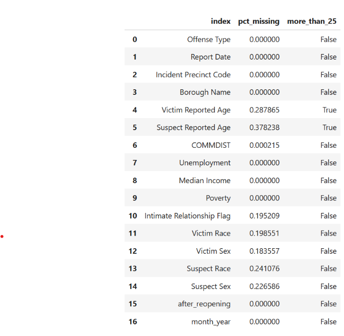
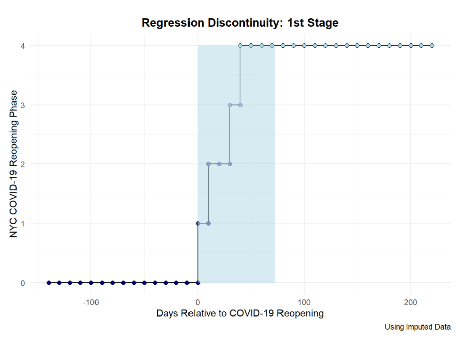
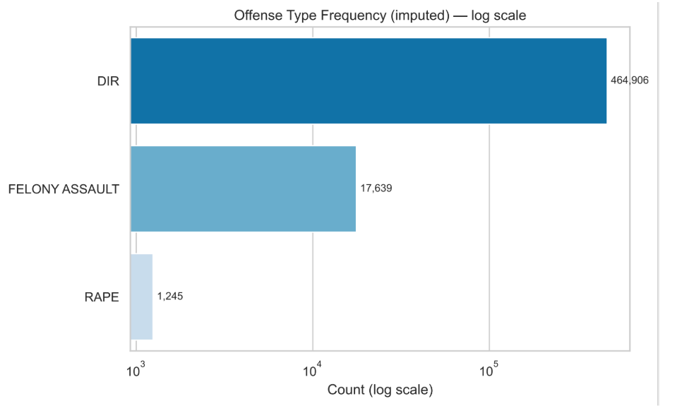
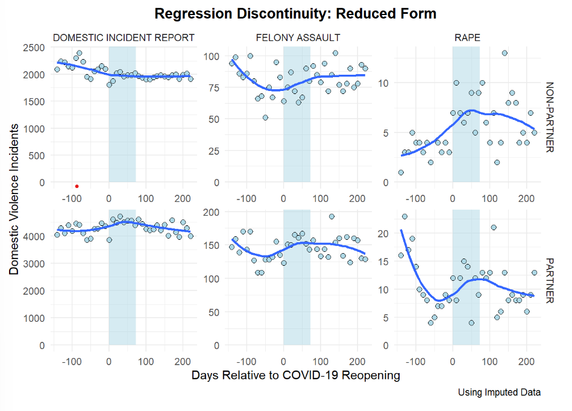

**By Elisha Clark, Kaitlyn Vana, Helen Wang, and Emily Zhao**

---

## Problem Statement

Our project is largely focusing on answering one main question:

> **How did COVID-19 re-opening impact domestic violence report rates in New York City?**

We know that COVID-19 created unprecedented social conditions that may have exacerbated domestic violence, namely increased isolation, financial stress, reduced access to support networks, and extended proximity between victims and potential perpetrators. As such, we were curious to see if reopening after the pandemic had a significant impact on Domestic Violence. Previous work had been done in New Orleans on the effect of COVID-19 on domestic violence but we were interested in exploring it in the context of New York City, primarily because:

- It had one of the strictest COVID-19 restrictions in the U.S.
- Had clearly defined policy phases for re-opening.

---

## Data

For our project, we pulled data from NYC Open Data's ENDGBV: The Intersection of Domestic Violence, Race/Ethnicity and Sex dataset, which contains a collection of NYPD domestic violence reports from 2020 and 2021. The dataset contains a wide variety of time, geographic, and categorical variables on the incident.

We were missing data for some variables, as seen in Figure 1:

<figure>
  
  <figcaption>Figure 1. % of Missing Data by Variable</figcaption>
</figure>

For our purposes, given the volume of missing data, we elected to drop all age variables and impute the remainder using the most frequent value. To ensure that this imputation process wouldn't significantly affect our results, we replicated analyses with both the imputed and nonimputed dataset.

---

## Method

To see if COVID Reopening had a significant effect on Domestic Violence Rates, we used a Fuzzy Regression Discontinuity Design to evaluate the effects. Regression Discontinuity is a quasi-experimental framework that evaluates the effect of an intervention (in this case, COVID-19 Reopening) by comparing observations (i.e. Domestic Violence Report Incidents) before and after the cutoff point where the intervention was implemented. In this case, we chose a "Fuzzy" design, as the policy wasn't implemented immediately and was established in phases, meaning that re-opening occurred gradually rather than at once.

<figure>
  
  <figcaption>Figure 2. NYC COVID-19 Reopening Phases</figcaption>
</figure>

If you look at Figure 2, for example, we see that reopening occurred slowly in phases across the area shaded in blue, with Phase One starting on June 8th of 2020 and Phase Four starting on July 20th of 2020. In our models, we used the Phase One date as the cutoff for when re-opening began to occur.

In our data, there are three main offense categories that are further broken down into intimate partner vs. non-partner offenders:
- Domestic Incident Report (DIR)
- Felony Assault
- Rape

The distribution of incidents by offense type can be seen below in Figure 3:

<figure>
  
  <figcaption>Figure 3. Distribution of Incidents by Offense Type</figcaption>
</figure>

We choose to model offense types separately by non-partner and partner offenders in our study to highlight specific trends and characteristics in domestic violence incident reports. As such, we fit 6 different regression discontinuity models. The code used to conduct these analyses can be accessed at this [github repository](#).

---

## Results

Figure 4 displays our regression discontinuity results for each category. Each category is further categorized by the victim's relationship with the perpetrator (non-partner vs. partner).

The most robust discontinuities among these graphs appear in the most severe offense categories (rape and felony assault). This suggests that reopening rather than the initial lockdown was the inflection point at which these violent crime instances increased, particularly with non-partner crimes. Partner and non-partner felony assault also follow this pattern with less severity. Domestic Incident Reporting has a weaker trend and presents the absence of a trend with relationship to re-opening phases.

<figure>
  
  <figcaption>Figure 4. Regression discontinuity reduced-form plots of DV incident counts by offense type (columns) and offender-victim relationship (rows)</figcaption>
</figure>

---

## Conclusions

This study produced a few conclusions worth discussing:
- The reopening threshold, rather than the initial lockdown, was the inflection point at which serious DV incidents rose
- Aggregate DV reporting volume can present misleading results, as Domestic Violence Incident Reports (DIV) dominate the dataset
- These results could inform specific resource allocation adjustment refinements during and after pandemics specifically applied to New York City that expands on the New Orleans study our project was inspired by ("Findings from a natural experiment on the impact of covid-19 residential quarantines on domestic violence patterns in New Orleans.")

---

## Future Research

As an extension of this research, we suggest utilizing Association Rule Mining. ARM, an unsupervised machine learning technique that uncovers patterns in large databases, is well-suited to uncovering frequent co-occurrences among demographic, situational, and geographic attributes among our DV dataset.

ARM could help us connect the dots among the disparate data points we've uncovered here, and help us get to the "why" of it all. We know there are patterns associated with re-opening and closing New York City, but the missing link is understanding which among the subgroups in the data were most affected. For example, low-income workers, doctors, and essential workers were less affected by quarantine measures. Looking at where domestic violence incidences originate by class could be revealed using ARM.

📄 Read the full paper and findings: [Analyzing COVID-19 and Domestic Violence Incidence using Regression Discontinuity Analysis](https://docs.google.com/document/d/11QdBIkEtnfLkyXqr9essXRWYaN377QNEQaGc3R5cyEk/edit?usp=sharing)
---

*Project by Elisha Clark, Kaitlyn Vana, Helen Wang, and Emily Zhao.*
